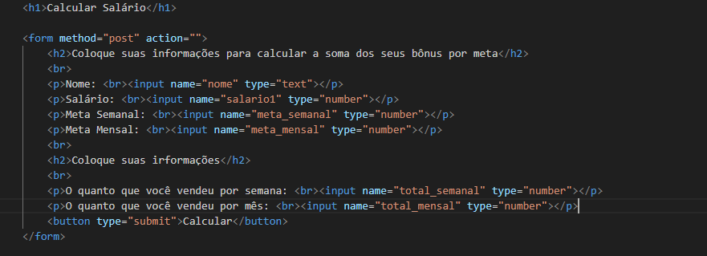

# Trabalho_Sistema_de_Salario
# Índice
[Projeto ](#projeto)  
[Descrição](#descrição)  
[Funcionalidades](#funcionalidades)  
[Tecnologias ultilizadas](#tecnologias-ultilizadas)    
[Fontes consultadas](#fontes-consultadas)  
[Autores](#autores)  

# Projeto 

Essa tarefa tem como objetivo simular o cálculo dos salários dos vendedores de uma empresa, e foi utilizada no processo seletivo para o cargo de assistente administrativo, onde participaram Fabinho e Renata.

A empresa estabeleceu algumas regras:

Salário Base: Todo vendedor tem um salário mínimo garantido como pagamento base pelos serviços prestados.

Meta de Venda Semanal: Cada vendedor tem uma meta de venda semanal no valor de 20 mil reais, totalizando 80 mil por mês por vendedor.

Bônus por Alcance de Metas: Vendedores que ultrapassarem as metas semanais receberão um percentual sobre o excedente da meta semanal. Além disso, aqueles que excederem a meta mensal também receberão um bônus sobre o valor excedente, desde que tenham cumprido todas as metas semanais.

Os valores dos bônus são definidos como:

Para o cumprimento da meta semanal: 1% sobre o valor da meta.
Para o excedente da meta semanal: 5% sobre o excedente da meta semanal.
Para o excedente da meta mensal: 10% sobre o excedente da meta mensal.
Por exemplo, se um vendedor atingir ou ultrapassar a meta semanal todas as semanas do mês com vendas no valor de 21.000 reais, ele receberia os seguintes bônus:

Bônus pelo cumprimento da meta semanal: 200 reais (1% de 20.000) por semana, totalizando 800 reais.
Bônus pelo excedente da meta semanal: 5% sobre 1.000 reais (21.000 - 20.000) por semana, totalizando 200 reais.
Bônus pelo excedente da meta mensal: 10% sobre 4.000 reais (20.000 x 4 - 80.000) no mês, totalizando 400 reais.
Assim, o salário final do colaborador seria calculado somando o salário mínimo, os bônus pelo cumprimento e excedente da meta semanal, e o bônus pelo excedente da meta mensal, se aplicável.

É importante destacar que se o vendedor não conseguir atingir ao menos uma das metas semanais, ele perde o direito ao bônus pelo excedente da meta mensal, recebendo apenas o bônus pelo excedente da meta semanal nas semanas em que atingir essa marca.
 
 
<strong>Disciplina:</strong> Programação Web I.  
<strong>Professor:</strong>  Leonardo Santiago Sidon da Rocha.  

# Descrição

 
Esse trecho escreve as informações que o usuário precisara informar para a concretização do código.
 
 

 
Esse trecho de código PHP verifica se determinados campos foram preenchidos e submetidos em um formulário HTML através do método POST. Se os campos estiverem definidos, seus valores são atribuídos a variáveis locais para posterior uso no script PHP.
 
 

 
Esse trecho de código PHP calcula o bônus semanal de um vendedor com base no valor total de suas vendas semanais. Ele verifica se o valor total de vendas atinge ou ultrapassa a meta semanal definida. Se a meta for alcançada, calcula o bônus adicionando 1% do valor da meta e 5% do excedente das vendas em relação à meta ao total do bônus semanal.
 
 

  
Esse trecho de código PHP calcula o bônus mensal de um vendedor com base no valor total de suas vendas mensais. Ele verifica se o valor total de vendas excede a meta mensal definida. Se exceder, calcula o bônus adicionando 10% do valor excedente das vendas em relação à meta ao total do bônus mensal.
 
 

 
Este trecho de código PHP calcula o salário final de um vendedor e exibe na tela o nome do vendedor, seus bônus semanal e mensal, e seu salário final. Se algum campo do formulário não estiver preenchido, exibe uma mensagem de erro pedindo para preencher todos os campos.

# Funcionalidades

| Métodos PHP | Funcionalidade |
|--------------------|----------------|
| isset | é um método em JavaScript usado para verificar se um objeto possui uma propriedade específica.|
| $ ||Cria uma variável|
| echo |	A função `echo` exibe dados ou variáveis na saída padrão do PHP.|
| += | Adiciona o valor do lado direito à variável do lado esquerdo e armazena o resultado na própria variável. |
 
<h1> Exemplo de uso na prática </h1>

 
Colocando as informações sobre o tanto que a empresa paga por bonûs para a programação desenvolver o calculo.
 

 
Aqui você colocara as suas irformações sobre o seu trabalho.
 

 
E aqui tera o resultado de quanto você vai ganhar de bonus e o total juntando com o seu salario fixo e as vendas a mais.
## Tecnologias utilizadas

 *   
  PHP  
 *  
  HTML 
 *  
  CSS 
  
  ## Fontes Consultadas
  
  * https://www.php.net/manual/pt_BR/function.isset.php
  * Chat GPT
  * Git hub

# Autores

    Isabelle Nascimento de Oliveira  

    

  
